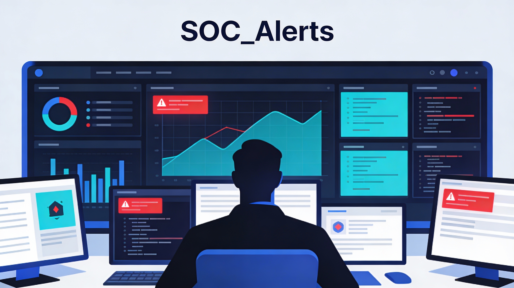

# SOC_Alerts

> **Résumé :** Ce repository montre la démarche que j'ai adoptée pour résoudre les différents challenges de LetsDefend et traiter les alertes provoquées.

> [!WARNING]
> Bien évidemment ceci n'est pas une liste exhaustive des alertes que j'ai traitées. Il s'agit de celles qui étaient les plus pertinentes.
Les alertes sont divisées en trois catégories:
- Web
- Malware
- Phishing
